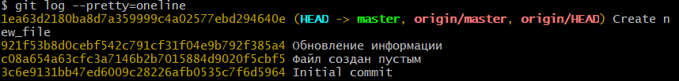
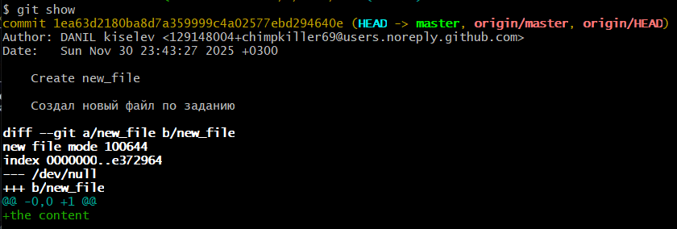
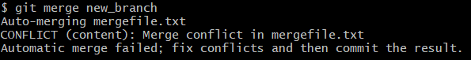
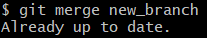
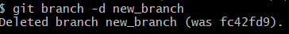
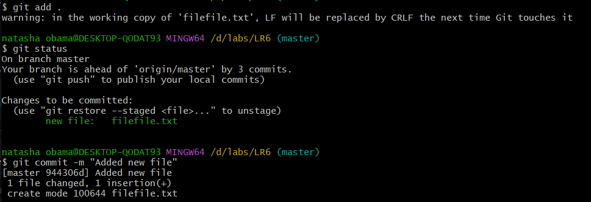
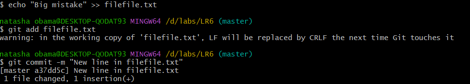

# Отчет по лабораторной работе №6
## Система контроля версий Git
### Цель: изучение базовых возможностей системы управления версиями, опыт работы с Git Api, опыт работы с локальным и удаленным репозиторием. 

---

### Ход работы:

    
#### 1. Клонирован гит репозиторий локально

#### 2. Добавлен файл через интерфейс гита и подтянуты изменения в локальный репозиторий

К сожалению, скрин утерян :()

---

#### 3. Получена история операций
   
   

#### 4. Просмотрены последние изменения

   

#### 5. Выполнено слияние веток

   

   Попытка слияния выдает конфликт

   

   Проблема решена при помощи текстового редактора

#### 6. Удалена побочная ветка
   

#### 7. Сделано 2 изменения

Первое изменение:

Второе изменение:

