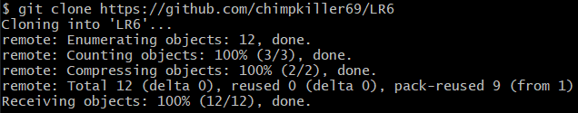

# Отчет по лабораторной работе №6
## Система контроля версий Git
### Цель: изучение базовых возможностей системы управления версиями, опыт работы с Git Api, опыт работы с локальным и удаленным репозиторием. 

---

### Ход работы:

    
#### 1. Клонирован гит репозиторий локально

